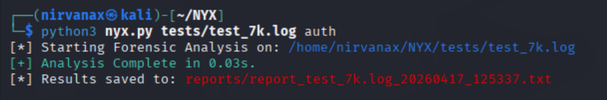
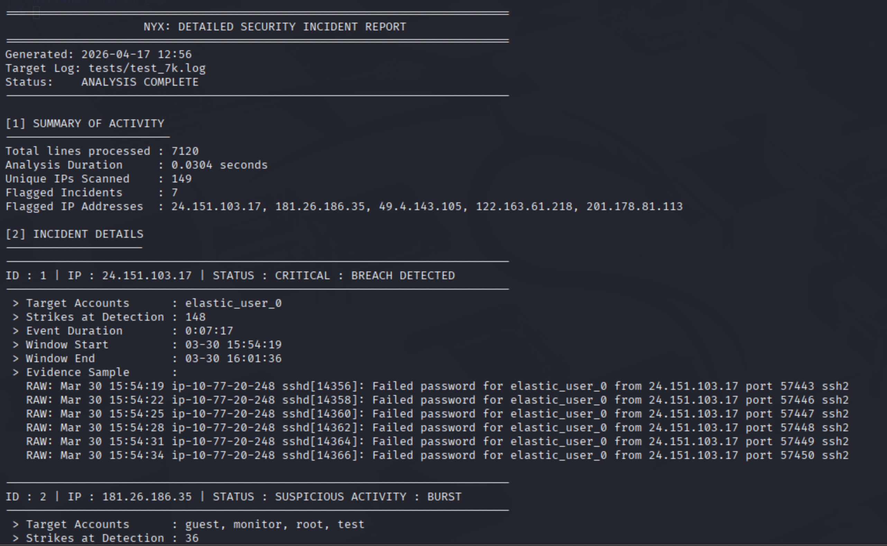

# NYX | Stateful Linux Auth Forensic Engine

**NYX** is a stateful forensic log analysis tool for Linux auth.log files, designed to extract structured security insights from raw authentication data. While standard parsers simply count lines, NYX reconstructs the attack lifecycle using PID tracking and look-ahead logic.

## 🧠 How It Works: The "Stateful" Advantage
Most log parsers fail when SSH sessions are fragmented or when logs are suppressed. NYX solves this through three core architectural pillars:

### 1. PID-to-IP Mapping (Stateful Attribution)
Linux logs often record an event (like a failed password) without repeating the source IP on that specific line, listing only the Process ID (PID).
* **The Problem:** Standard parsers skip these lines, leading to "Unknown IP" gaps.
* **The NYX Solution:** NYX maintains a dynamic state table. It maps the initial connection IP to its PID and carries that attribution across the entire session lifecycle, ensuring every event is tied to a specific actor.

### 2. Look-Ahead Logic & Suppression Handling
When a log shows `message repeated 5 times`, most tools see 1 event.
* **The Forensic Multiplier:** NYX uses look-ahead logic to detect these strings. It mathematically reconstructs the 5 missing attempts, re-injecting them into the telemetry improving accuracy of **event reconstruction** and **volume-based detection** logic
### 3. Breach Pattern Recognition (Triage)
NYX doesn't just look for failures; it looks for **transitions**.
* It tracks IP behavior history. If an IP has 50 failures followed by a single `Accepted password`, NYX flags this as a **Critical Breach**.

## ⚡ Performance
Processed large auth.log datasets efficiently (tested on ~800k+ line logs on Apple M3 hardware)
* **High-Speed Triage:** 800k+ lines processed in **~4.5s**.
* **Overhead:**  Low overhead during processing of standard and compressed log files (`.log.gz`).

## 🛠 Features
* **Smart Detection:** Multi-layered alerts for **Bursts** (velocity-based) and **High Volume** (persistence-based).
* **Automated Reporting:** Generates structured technical summaries in the `reports/` folder, designed for immediate SOC triage and incident documentation.
* **Transparent Whitelisting:** Authorized IPs are tagged with a `WHITELIST` status, allowing you to audit "authorized" behavior for credential misuse.
* **Critical User Monitoring:** Optional monitoring of high-value accounts such as`root`, `postgres`, or `admin`.

## 📊 Sample Output

*Example of the structured triage report generated by NYX.*

## 🚀 Roadmap: Planned Improvements
* **Web Server Analysis:** Integrating support for `access.log` to detect directory brute-forcing and SQL injection patterns.
* **Behavioral Modules:** Implementing advanced detection for **reverse shells** and **privilege escalation** through behavioral telemetry.
* **Multi-Format Export:** Adding JSON/CSV export support for integration with SIEM platforms (ELK/Splunk).

## 📦 Usage

1. **Setup:**
`git clone https://github.com/tushishvili/NYX.git && cd NYX`

2. **See Usage & Flags:**
`python3 nyx.py --help`

3. **View Results:** Check the formatted `.txt` report generated in the `reports/` folder.

## ⚙️ Config (config.py)
Modify detection sensitivity to match your environment:
* **THRESHOLD:** Hits required for a Burst alert.
* **TOTAL_VOLUME_THRESHOLD:** Total hits for High Volume detection.
* **WHITELIST:** Add trusted IPs to tag them as "Whitelist Activity".
* **CRITICAL_USERS:** List of high-value targets (e.g., `root`, `postgres`) to monitor closely.

